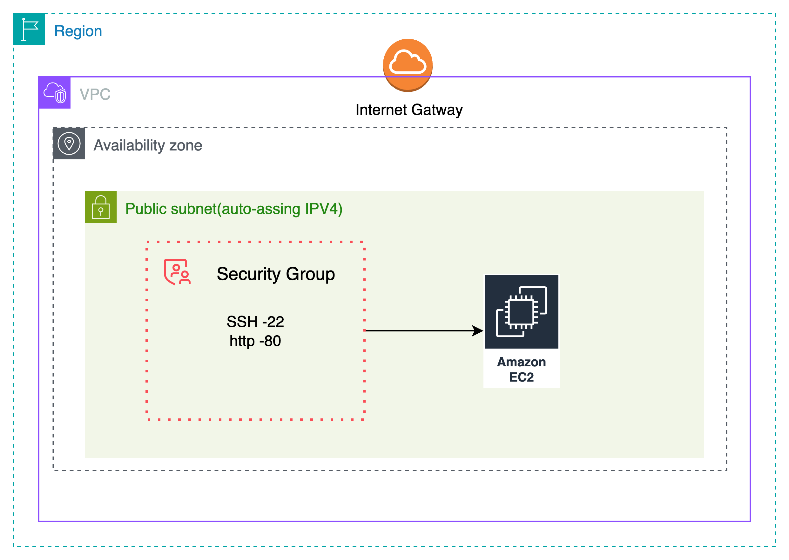
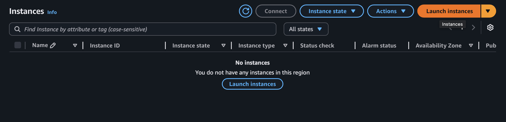
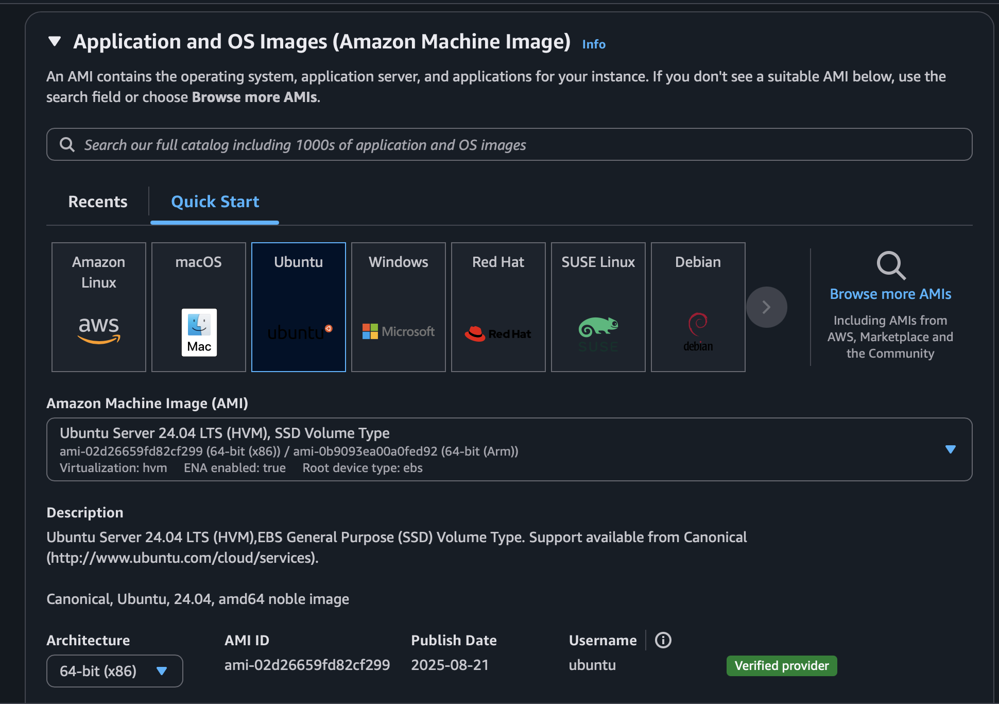
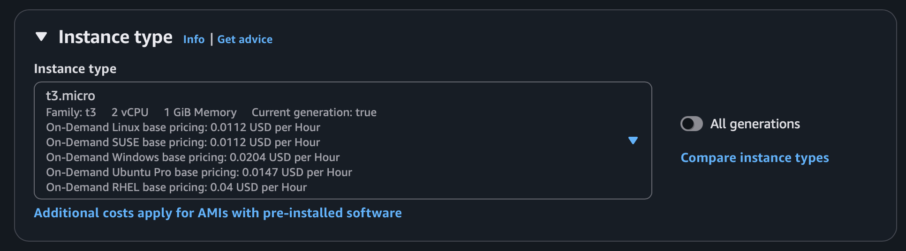
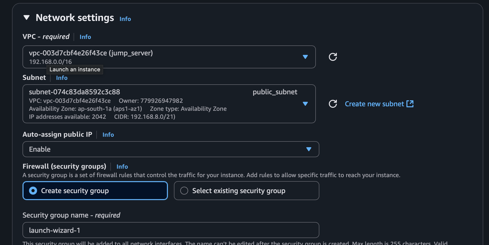
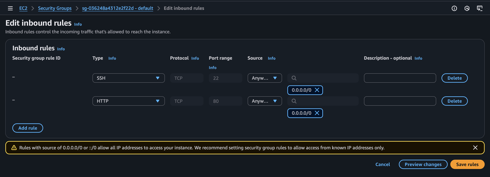
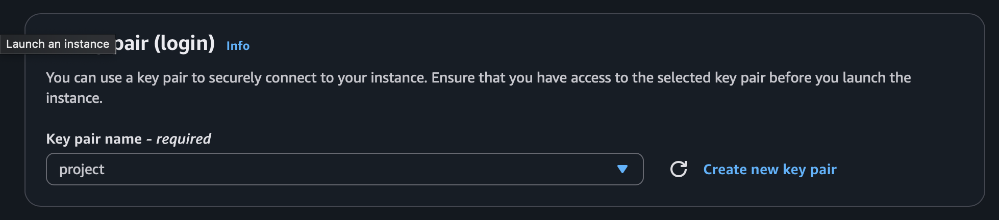
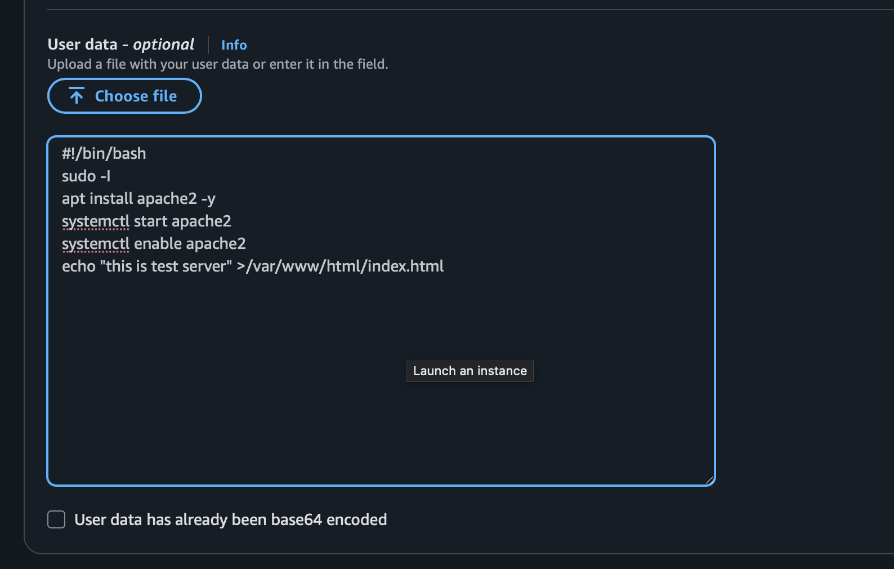
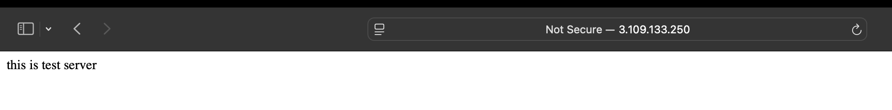
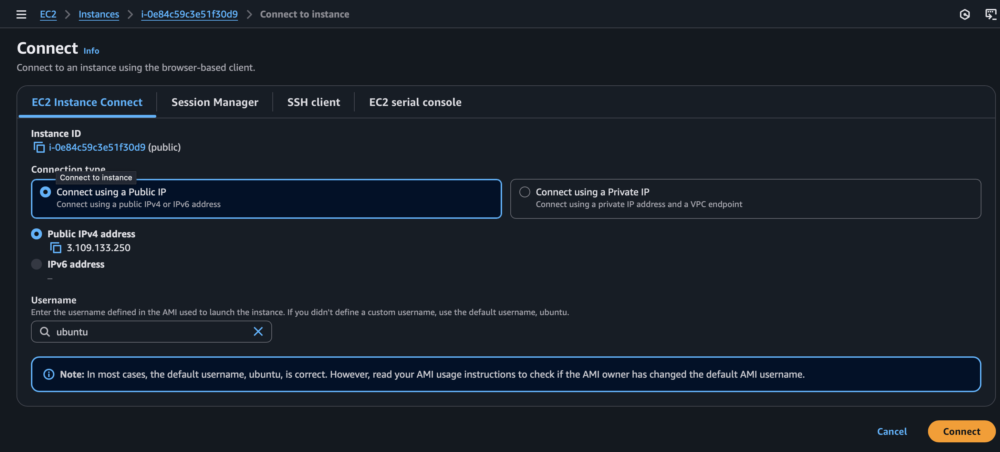

The goal of this lab is to launch a single EC2 instance in a public subnet that is accessible from the Internet via SSH.

## Architecture Diagram



## Overview

 In order to achieve the goal of this lab, you will have to go through the following steps:


1. Choose the operating system by selecting the [Amazon Machine Image (AMI)](https://docs.aws.amazon.com/AWSEC2/latest/UserGuide/AMIs.html).

2. Define the virtual hardware configuration by choosing an [Instance Type](https://docs.aws.amazon.com/AWSEC2/latest/UserGuide/instance-types.html).


3. Review the network settings.
check weather auto assing public ip is on or not --> enable


4. Review the storage settings.
5. Create tags (optional).

6. Configure the [Security Group](https://docs.aws.amazon.com/vpc/latest/userguide/VPC_SecurityGroups.html) rules (firewall).


7. Launch the instance (choosing or creating an [EC2 key pair](https://docs.aws.amazon.com/AWSEC2/latest/UserGuide/ec2-key-pairs.html)).


8. advance option run simple bash script
   
 ```bash
  #!/bin/bash 
sudo -i 
apt install apache2 -y 
systemctl start apache2 
systemctl enable apache2 
echo "this is test server $HOSTNAME" >/var/www/html/index.html
```
9. server check
   
10. if want to connect to instance click on connect
    
    
