## What is Bastion Host?
A Bastion host is a special-purpose server or an instance that is used to configure to work against attacks or threats. It is also known as the 'jump box' that acts like a proxy server and allows the client machines to connect to the remote server. It is basically a gateway between the private subnet and the internet. It allows the user to connect a private network from an external network and act as a proxy to other instances. (refrance: https://www.geeksforgeeks.org/blogs/what-is-aws-bastion-host/)

## Architecture Diagram
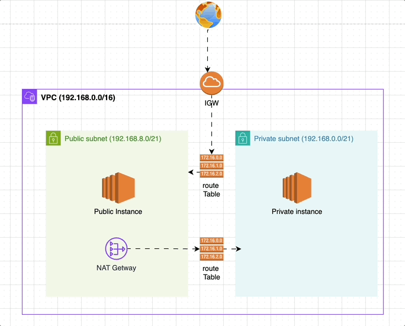

# Step 1 - Create VPC
Create a new VPC with the Name tag "jump_server" and the IPv4 CIDR block 192.168.0.0/16.
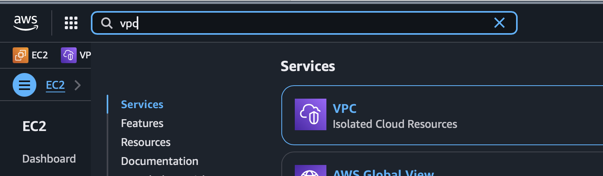
.
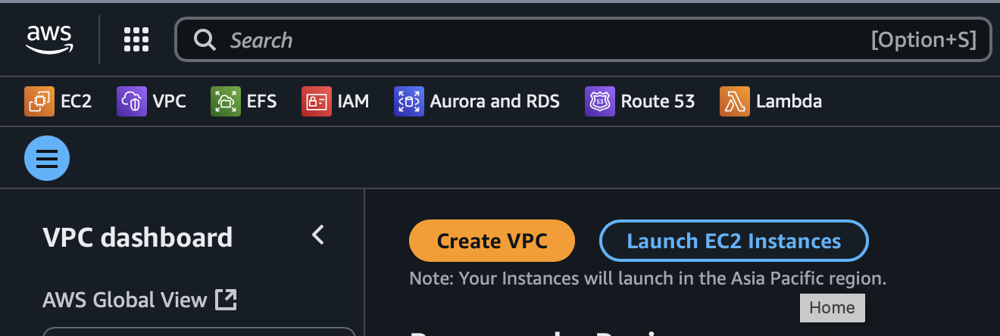
.
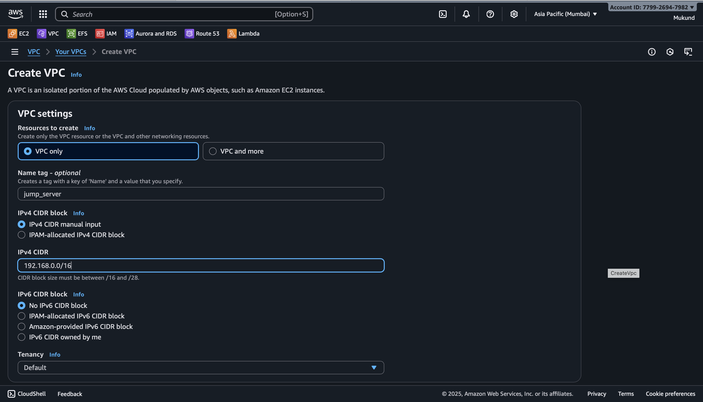

# step 2 - create subnet (public and private subnet 
## create public subnet using vpc "jump_server"--> ipv4 CIDR block 192.168.10.0/21 public subnet 
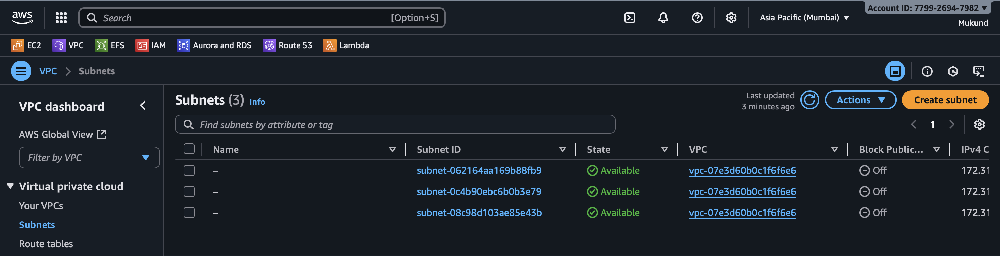
.
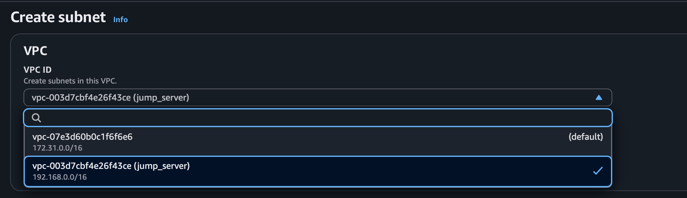
.
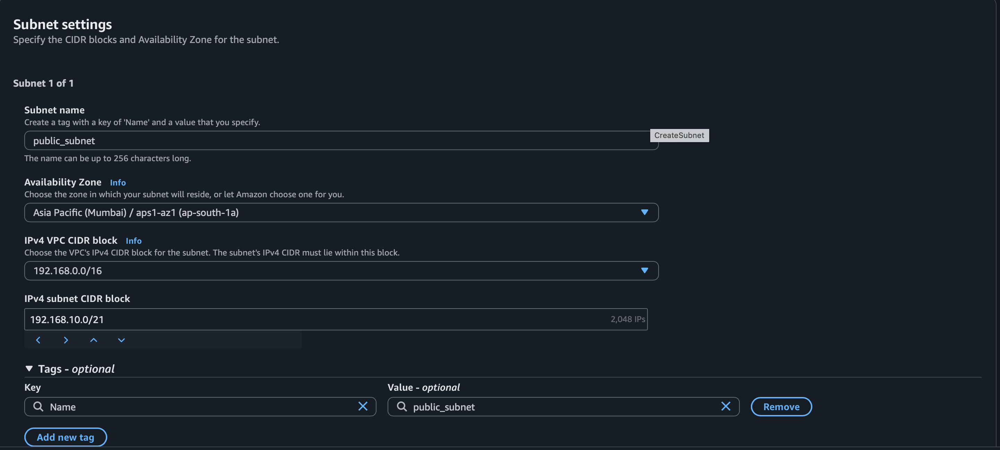

## create private subnet IPv4 CIDR block 192.168.0.0/21 private subnet 
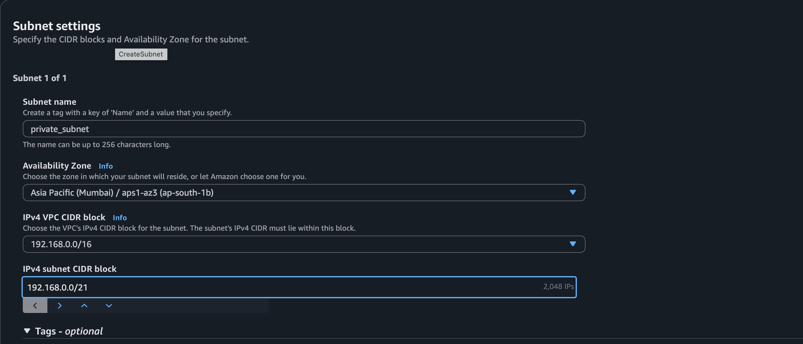

## show all the created subnets 
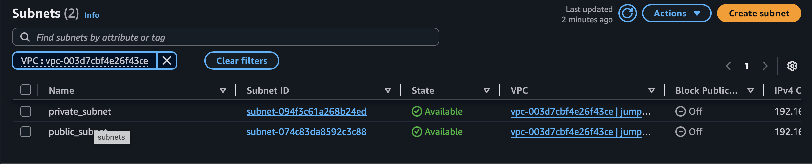

# step 3 - create Internet Getway 
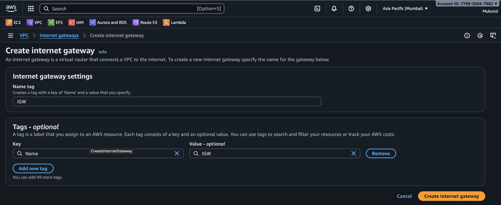

## navigate to action --> attach to vpc 
select the vpc to attach internet getway 
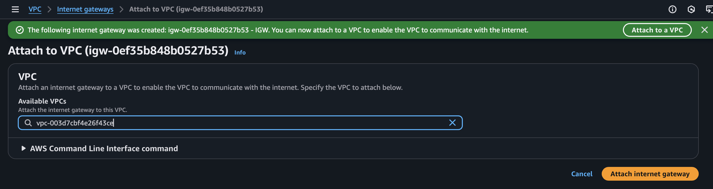
attach internet getway

## step 4 - create NAT getway 
while creating nat getway --> create it in public subnet so that internet flow 
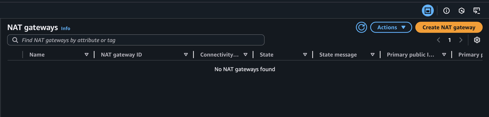
## while creating NAT getway allocate Elastic iP
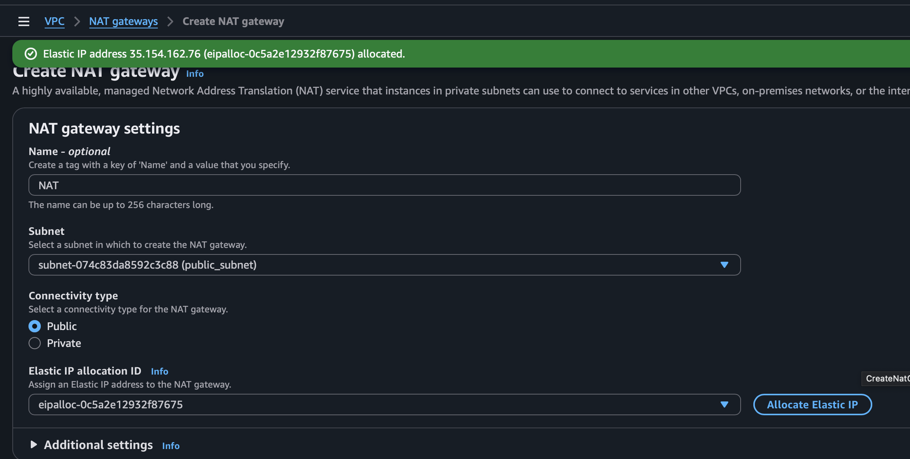

## step 5 - public route table
edit route table 
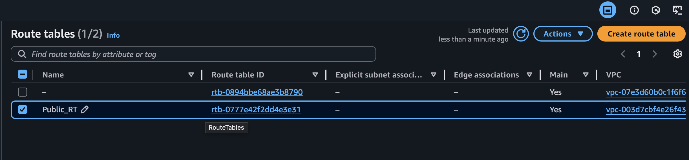
edit routes in public route table 
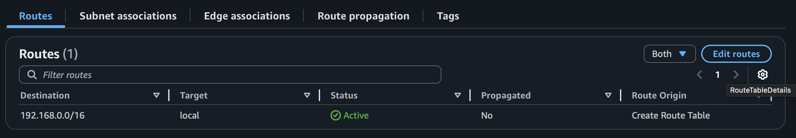
create entry of IGW in route table 
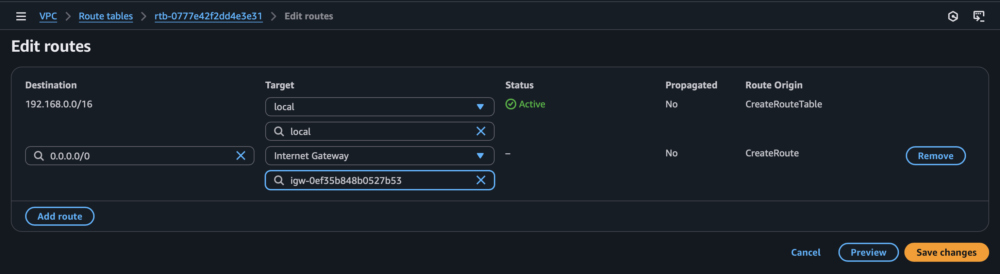
edit subnet association 
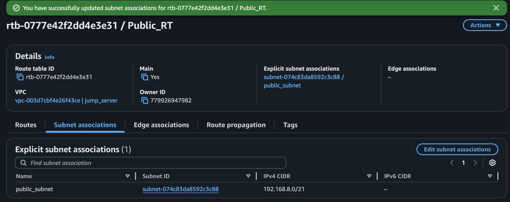
Give entry of public subnet in Route table 
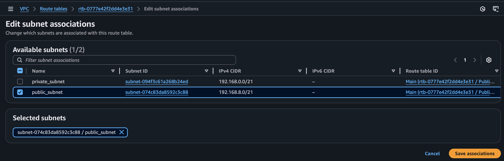

## step 6 - private route table 
create private route table
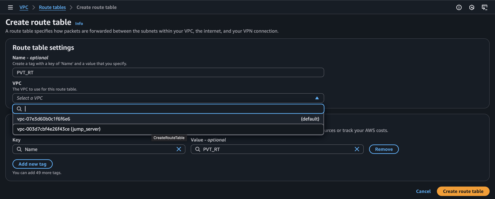
edit routes in private route table 
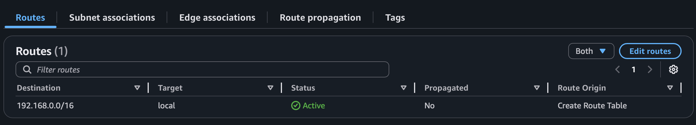
add an entry of NAT getway in private route table
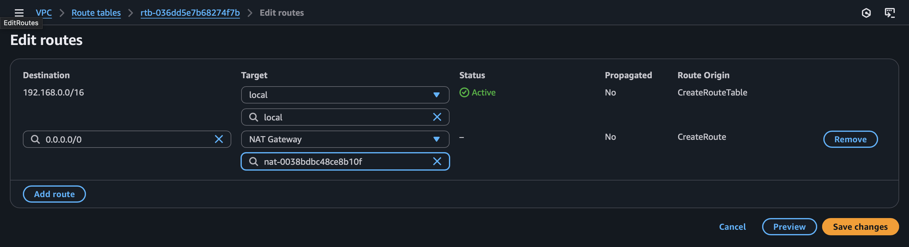
eddit subnet association in private route table 
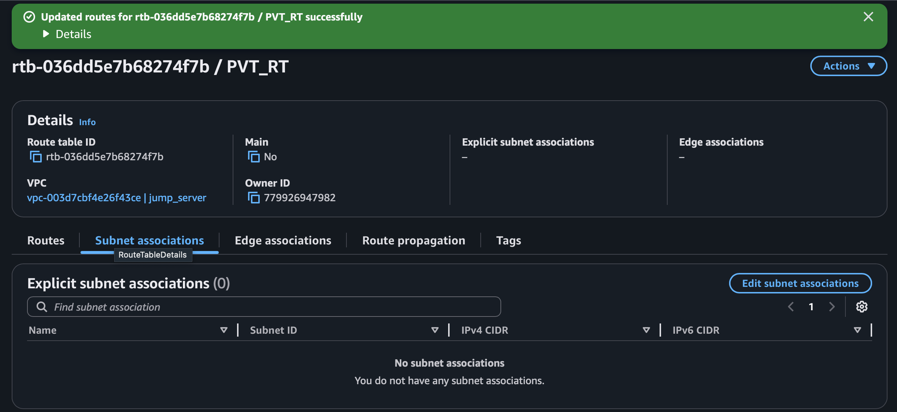
.
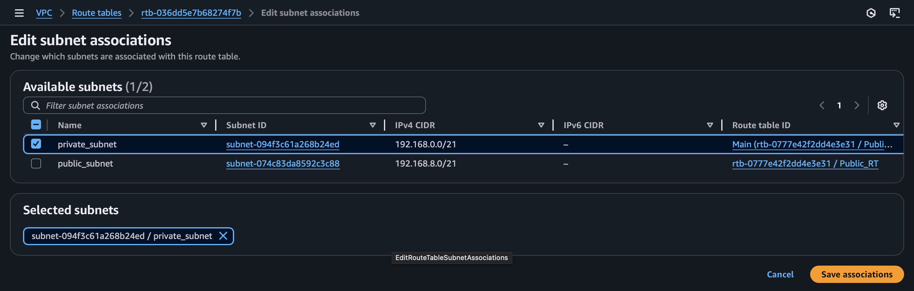

# check resource map 
## public 
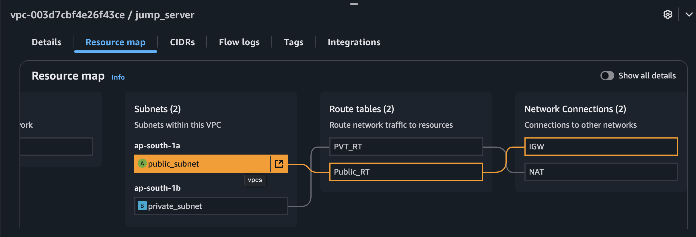
## private 
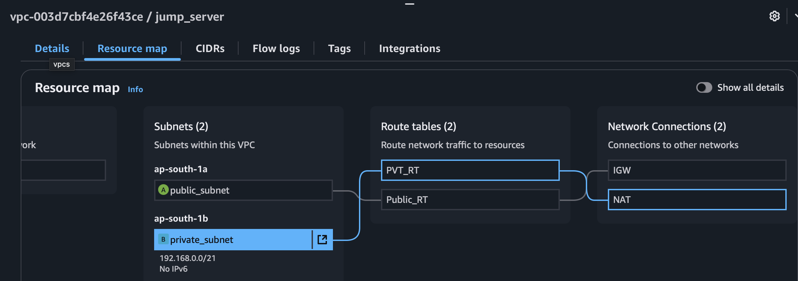

## step 7 - create public ec2 instance in public subnet [lab-1](../lab-1) 

## step 8 - create private ec2 instance in private subnet 
change in network section while creating private ec2 | public ipv4 -> disabale
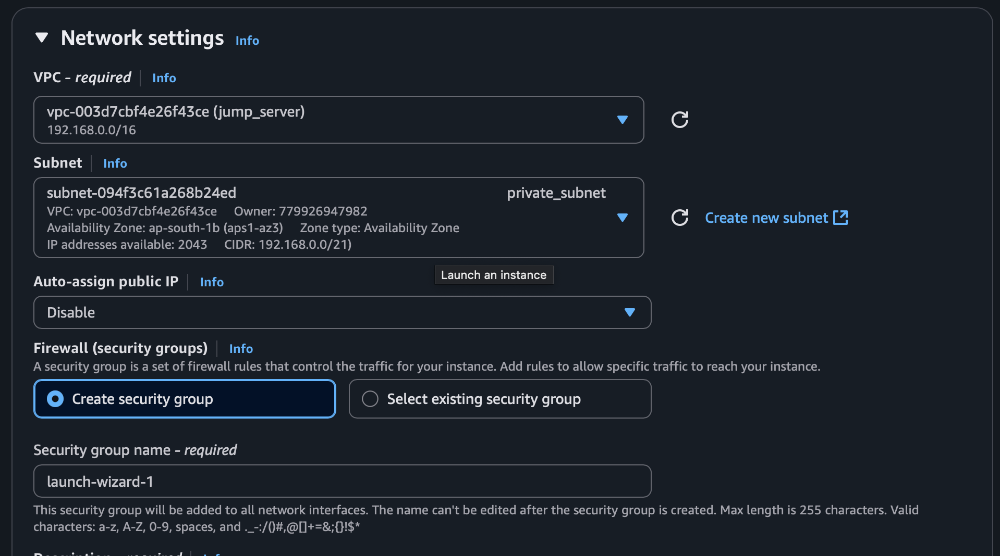

## ssh into private Ec2
check for private instance ipv4 (private ipv4)
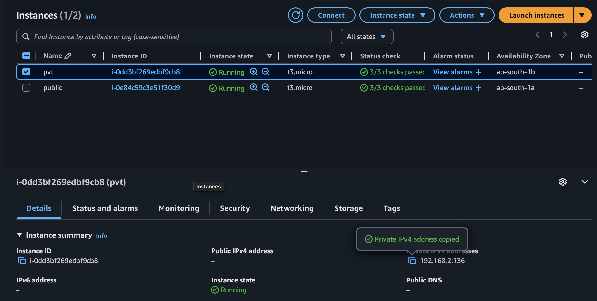
copy the keypair.pem in public ec2 to take ssh and follow the command given below 
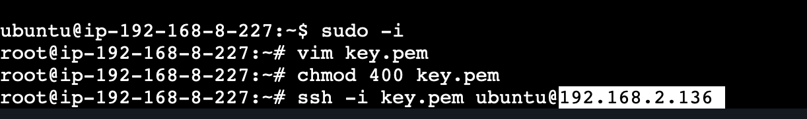

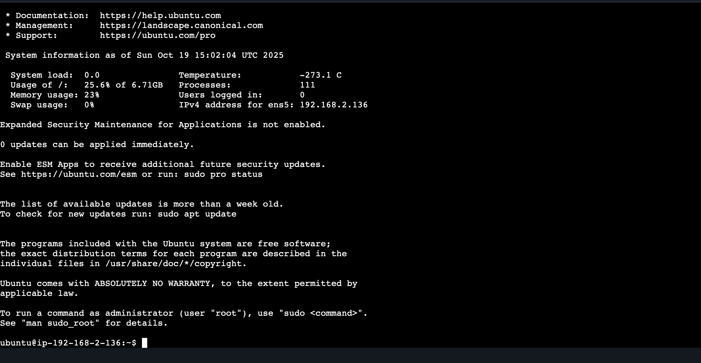

