# Application load balancer 
https://docs.aws.amazon.com/elasticloadbalancing/latest/application/introduction.html
A load balancer serves as the single point of contact for clients. The load balancer distributes incoming application traffic across multiple targets, such as EC2 instances, in multiple Availability Zones. This increases the availability of your application. You add one or more listeners to your load balancer.

# steps to create an Application load balancer 
## step 1 - Open EC2 → Load Balancers → Create Application Load Balancer, give it a name, set scheme Internet-facing, and keep listener HTTP:80.
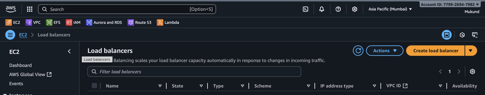
select ALB
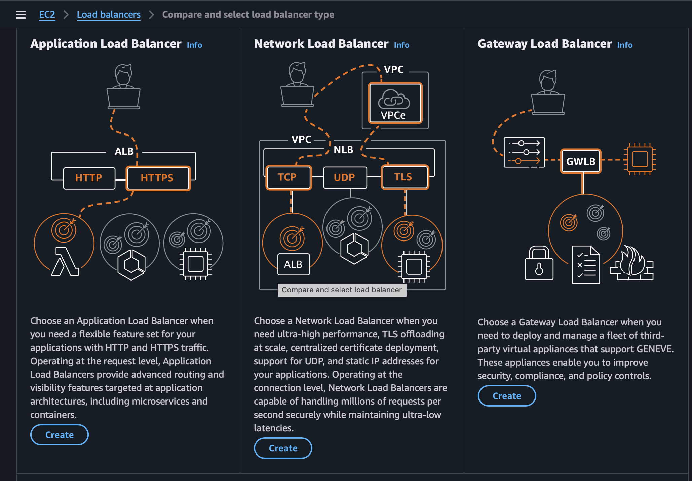
Give name and internet facing 
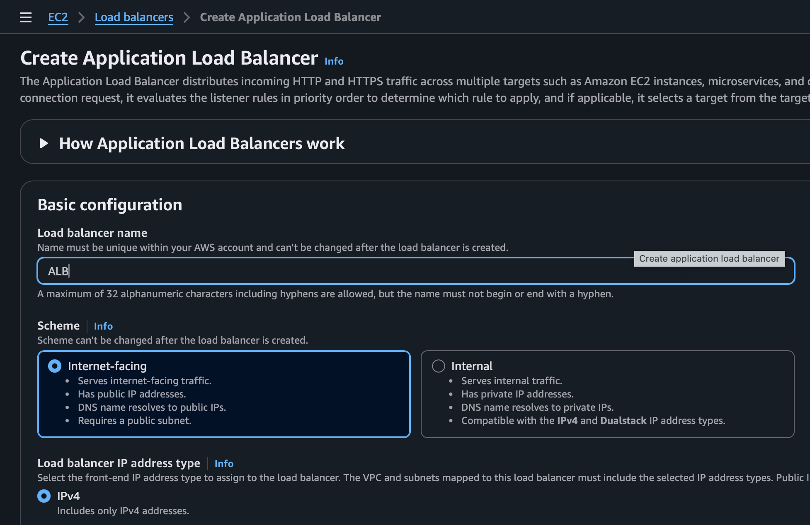

## step 2 - Select your VPC and choose at least two public subnets in different Availability Zones.
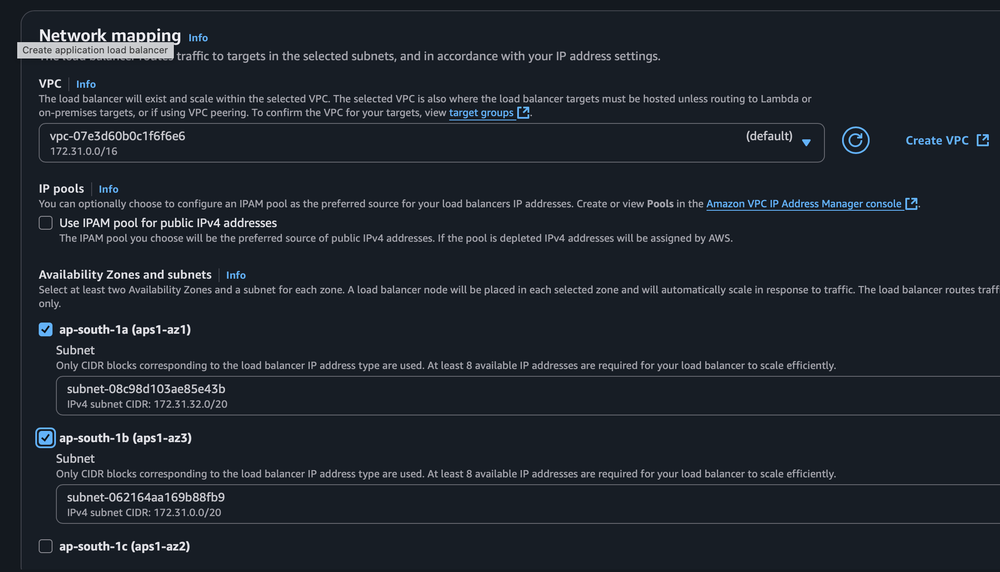

Attach or create a security group that allows inbound HTTP (port 80) from 0.0.0.0/0.
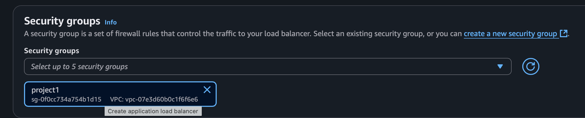

## step 3 - Create a new Target Group [lab-3/target](../Target)
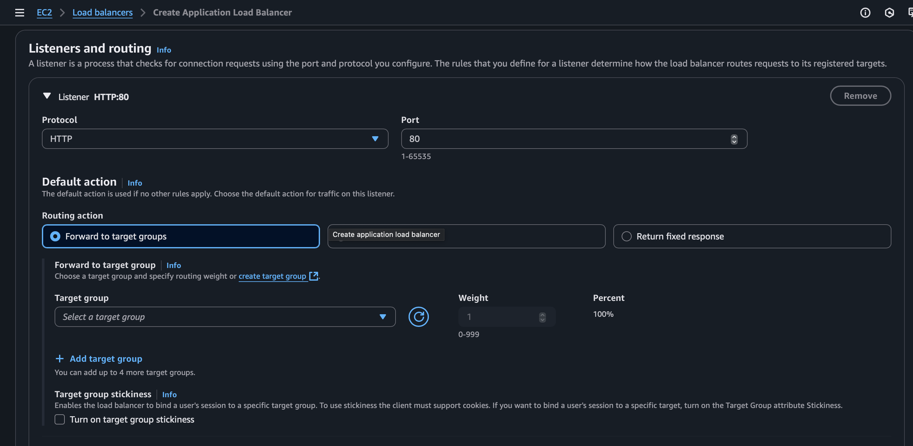
create Load balancer 

## step 4 - Register and add your EC2 instances to the target group.
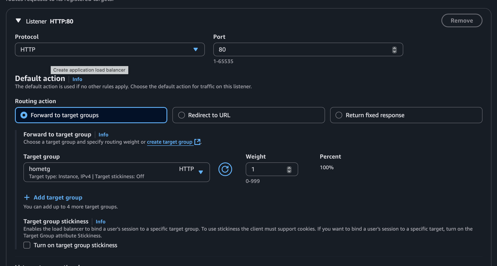
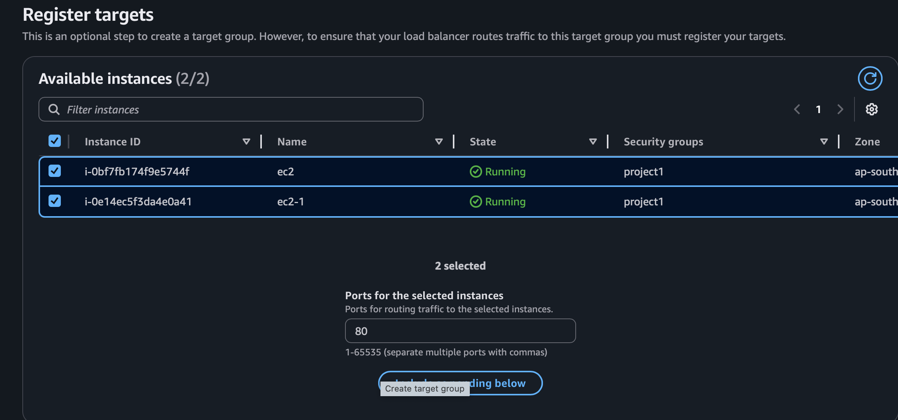

## step 5 - Register and add your EC2 instances to the target group /mobile/
Add rule --> mobile target group 
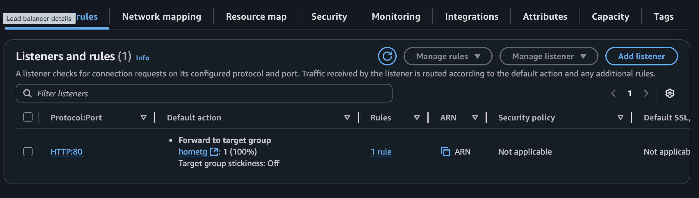
path based routing 
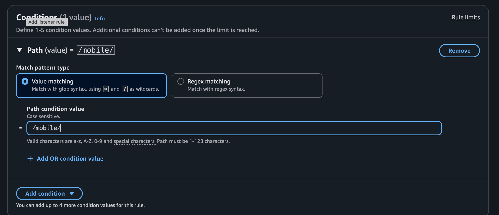

## step 6 - check all the EC2 instances 
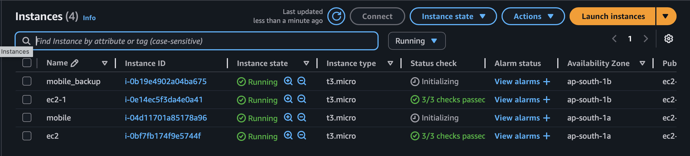

## step 7 - Create the ALB and test using its DNS URL in a browser.
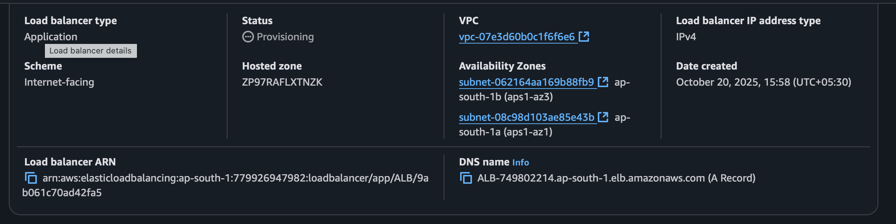
copy and check in browser 

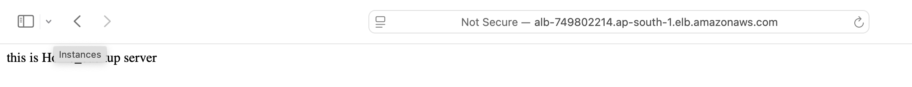
### path based routing in ALB 
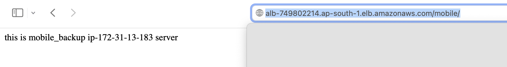

