## CLB (Clasic Load Balancer)
A load balancer distributes incoming application traffic across multiple EC2 instances in multiple Availability Zones. This increases the fault tolerance of your applications. Elastic Load Balancing detects unhealthy instances and routes traffic only to healthy instances.
https://docs.aws.amazon.com/elasticloadbalancing/latest/classic/introduction.html

# steps to create an classic load balancer 
## step 1 - navigate to load balancer in EC2 service & chose CLB 
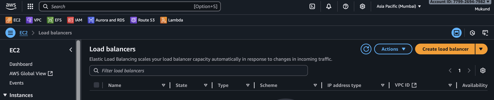
.
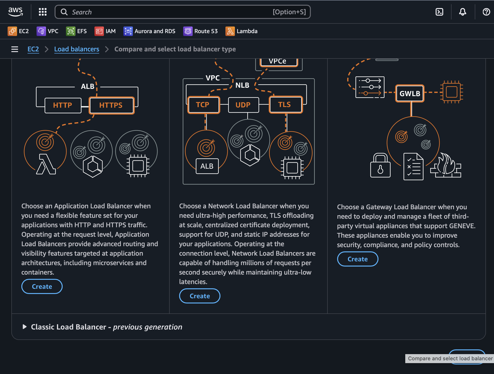

## step 2 - check basic configuration as name and internet facing you are using it expose application 
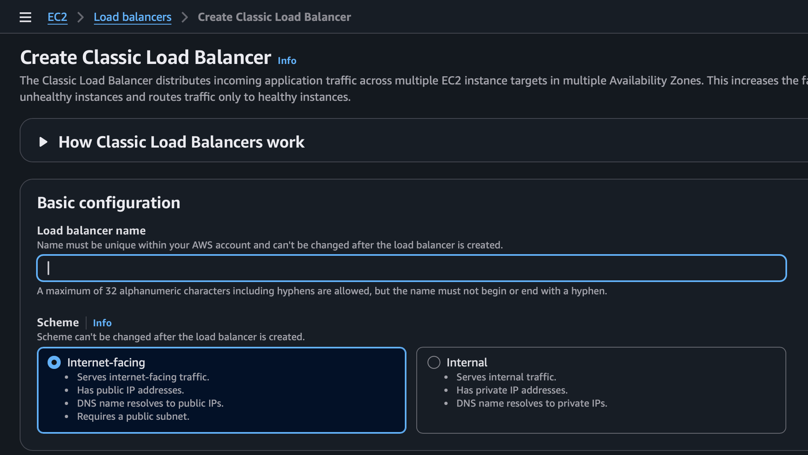

## step 3 - network maping chose AZ (multi az to balance load) & sequrity 
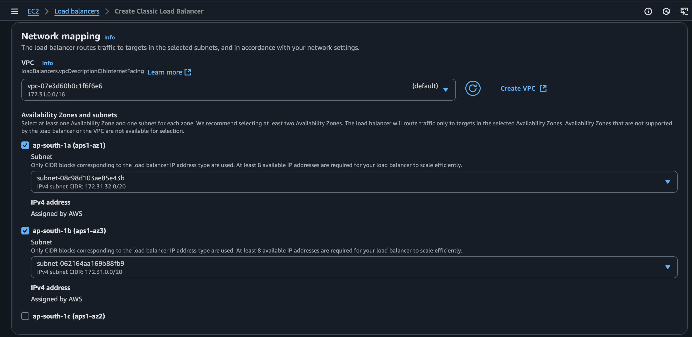
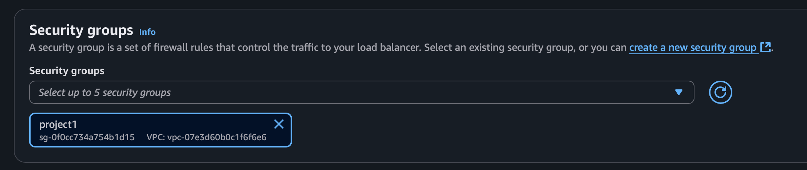

## step 4 - check for lisner port and health check / 
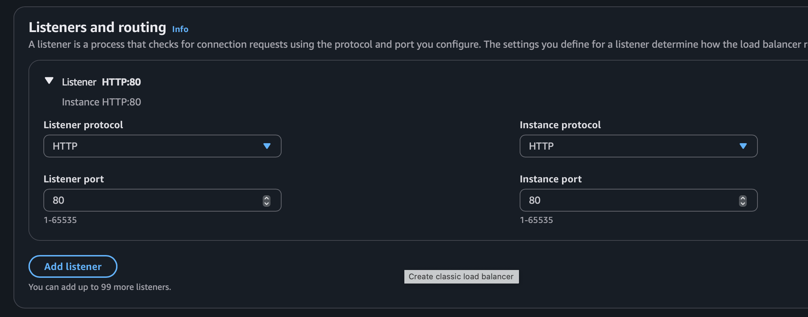
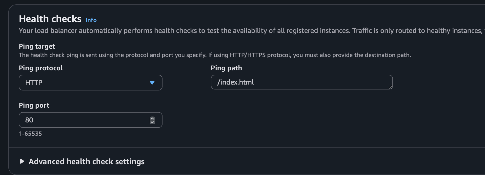

## step 5 - review settings
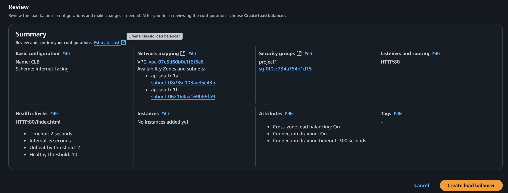

## step 6 - manage instance for load balancing & and chose instances  
lanch ec2 instance [lab-1](../../lab-1)
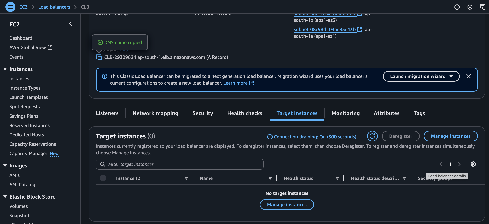
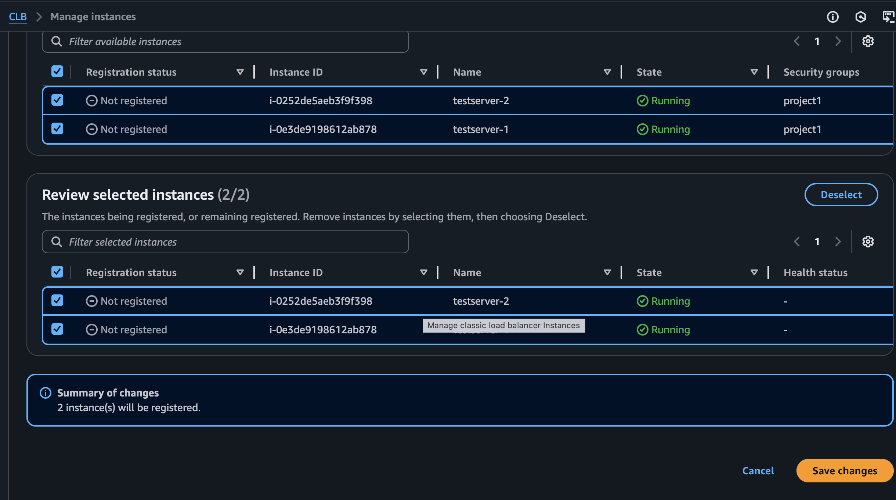

## step 7 - copy DNS and check in browser weather instance hitting differet server for balancing load 
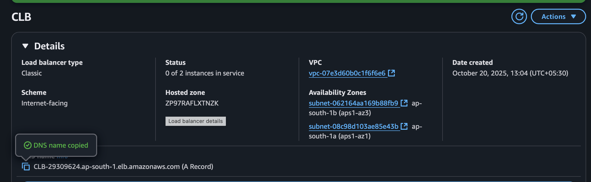
server dns
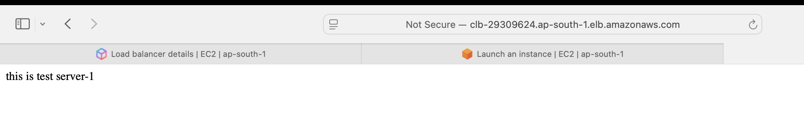
.
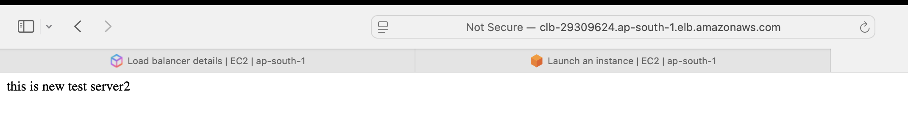

