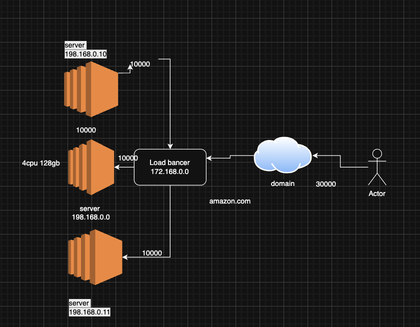

Elastic Load Balancing automatically distributes your incoming traffic across multiple targets, such as EC2 instances, containers, and IP addresses, in one or more Availability Zones. It monitors the health of its registered targets, and routes traffic only to the healthy targets. Elastic Load Balancing scales your load balancer capacity automatically in response to changes in incoming traffic.

https://www.geeksforgeeks.org/system-design/what-is-load-balancer-system-design/

types: 
1. Application Load Balancer (ALB)
Function: Operates at the application layer (Layer 7) and distributes traffic based on content-specific data, such as the URL path or host.
Best for: Routing HTTP/HTTPS traffic to different applications or microservices within a single data center.
Key feature: Can perform advanced routing decisions and SSL termination. 

2. Network Load Balancer (NLB)
Function: Operates at the transport layer (Layer 4) and distributes traffic based on IP address, port, and other network information. 
Best for: Balancing TCP and UDP traffic at very high performance levels. 
Key feature: Preserves the client's source IP address. 

3. Gateway Load Balancer (GLB)
Function: Routes traffic to a fleet of third-party virtual appliances, like network firewalls or intrusion detection systems. 
Best for: Inserting third-party network security appliances into the traffic path in a scalable way. 
Key feature: Enables the use of third-party appliances to inspect and manage traffic. 

4. clasic Load balancer (previous generation)
Elastic Load Balancing automatically distributes your incoming traffic across multiple targets, such as EC2 instances, containers, and IP addresses, in one or more Availability Zones. It monitors the health of its registered targets, and routes traffic only to the healthy targets. Elastic Load Balancing scales your load balancer as your incoming traffic changes over time. It can automatically scale to the vast majority of workloads.

-----------------------------------------------------------------------------------------------------
crete an High Availability aplication: 

step1: Launch EC2 Instances
Launch 2 EC2 instances (for HA) in different subnets.
Install your web application on both:
Home page → www.example.com/home
Mobile page → www.example.com/mobile
Ensure security group allows HTTP (80) or HTTPS (443).

step2:Create Target Groups
Go to EC2 → Target Groups → Create Target Group
Create two target groups:
HomePage-TG → Add both EC2 instances
MobilePage-TG → Add both EC2 instances (or different instances if needed)
Protocol: HTTP, Port: 80
Health checks: /home for HomePage-TG, /mobile for MobilePage-TG

step3: Create an Application Load Balancer (ALB)
Go to EC2 → Load Balancers → Create Load Balancer → Application Load Balancer
Basic Settings:
Name: MyALB
Scheme: Internet-facing
Listeners: HTTP 80 (or HTTPS 443)
Availability Zones: Select the two public subnets

Sg: Configure Security Group for ALB
Allow HTTP (80) / HTTPS (443) from anywhere (0.0.0.0/0)

step4: Configure Listener Rules (Path-Based Routing)
In ALB → Listeners → View/edit rules
Default rule → Can route to HomePage-TG
Add path-based rules:
/mobile/ --> mobile_page_TG

copy link and paste it in browser to check the high availability of the application 

