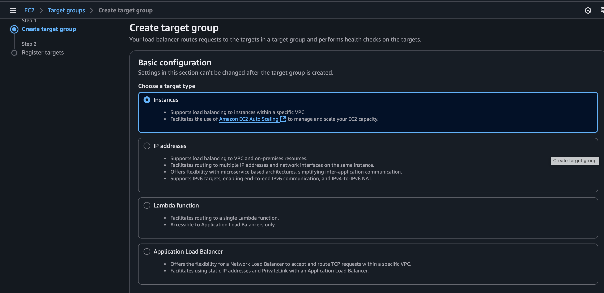
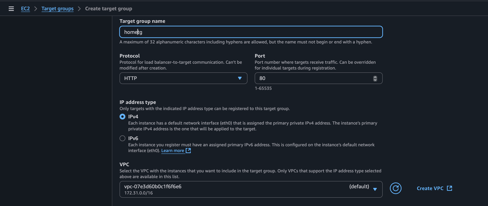
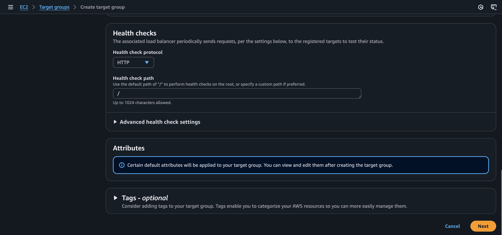
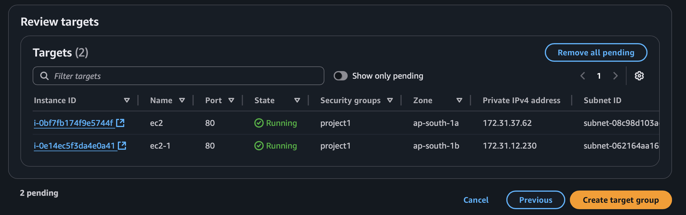
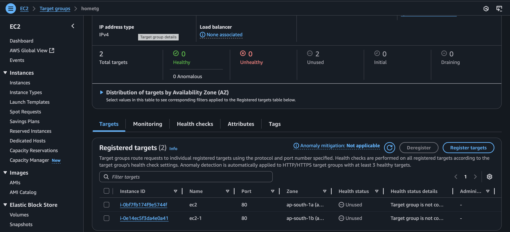

# Target Group 
https://docs.aws.amazon.com/elasticloadbalancing/latest/application/load-balancer-target-groups.html

Target groups route requests to individual registered targets, such as EC2 instances, using the protocol and port number that you specify. You can register a target with multiple target groups. You can configure health checks on a per target group basis. Health checks are performed on all targets registered to a target group that is specified in a listener rule for your load balancer.

## steps to create Target Group

## step 1 - navigate to target group in EC2 service 

Give name to Target Group:

## step 2 - give Health check Path /your_index.html and NEXT

## step 3 - Register targets and Review & create

.

create target group

## step 4 - check for target gruop 

