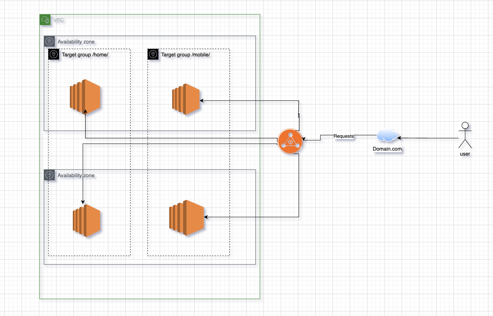

advance 

ALB (Application Load Balancer) is an AWS service that automatically distributes incoming web traffic across multiple targets (like EC2 instances, containers, or IPs) in one or more Availability Zones.

Works at Layer 7 (Application Layer) of the OSI model.
Supports HTTP, HTTPS traffic.
Can route traffic based on URL path, hostname.
Improves availability, scalability, and fault tolerance of your application.

